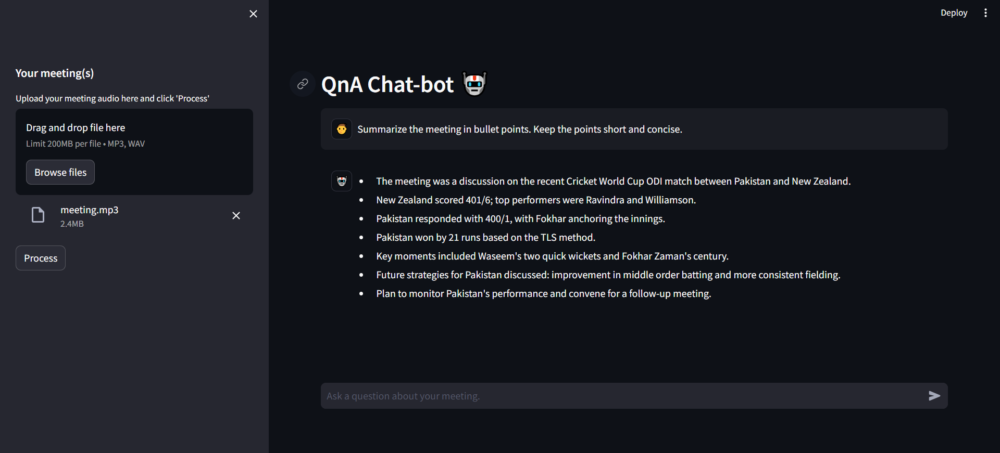
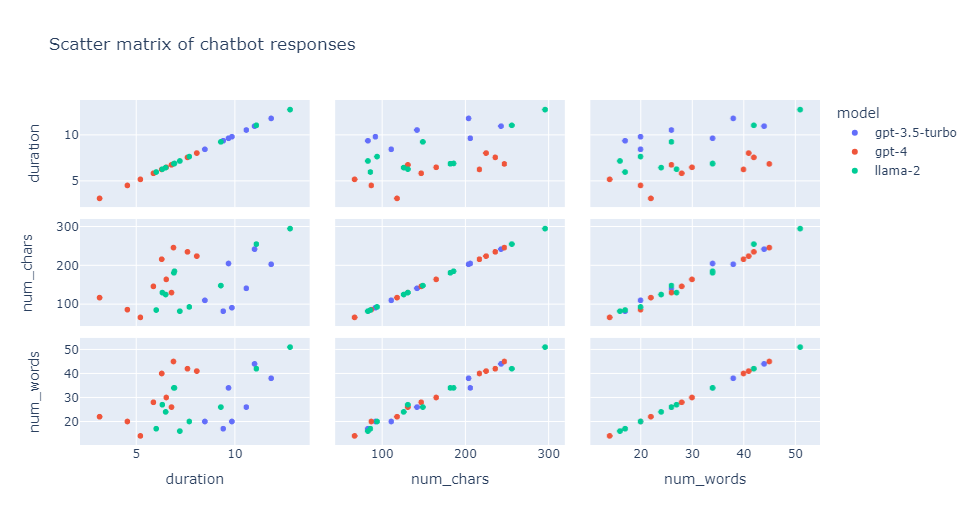

# QnA chat-bot w/ Langchain, FAISS, LLaMa 2.0 and OpenAI

This repository contains a Streamlit web application that allows users to chat with multiple documents. The application enables users to ask questions about their uploaded documents and provides answers based on the content of those documents.

In the current context, the application is used as an assistant for analyzing data from any virtual meeting transcript.



## Evaluation

The chat-bot performance is evaluated over a bunch of metrics using the `thefuzz` library and the Levenshtein distance technique to compare bot responses over different LLMs. This analysis is done in the [analysis.ipynb](./notebooks/analysis.ipynb) file.



## Installation

To run this application, you need to install the required dependencies. You can do this using `pip` and the provided `requirements.txt` file.
```
pip install -r requirements.txt
```
or you can simply copy the following command.
```
pip install streamlit python-dotenv langchain openai tiktoken faiss-cpu
```

## Usage

### Setting up `.env` file

In order to use the application, you have to set up your API key in the `.env-sample` file using the following command. After entering your API, rename the file to `.env`.

Now you can launch the application, use the following command:
```
streamlit run app.py
```
This will start the Streamlit web app, which you can access in your web browser.

## Contributing

If you'd like to contribute to this project, please follow the standard open-source guidelines. You can fork the repository, make changes, and create a pull request.

## License

This project is licensed under the MIT License. You can find the full license details in the [LICENSE](LICENSE) file.

## Acknowledgments

- [Chat with Multiple PDFs - Alejandro AO](https://github.com/alejandro-ao/ask-multiple-pdfs)
- [ChatGPT Retrieval - TechLead](https://github.com/techleadhd/chatgpt-retrieval/tree/main)
- [Using LLaMA 2.0, FAISS and LangChain for Question-Answering on Your Own Data - Murtuza Kazmi](https://medium.com/@murtuza753/using-llama-2-0-faiss-and-langchain-for-question-answering-on-your-own-data-682241488476)